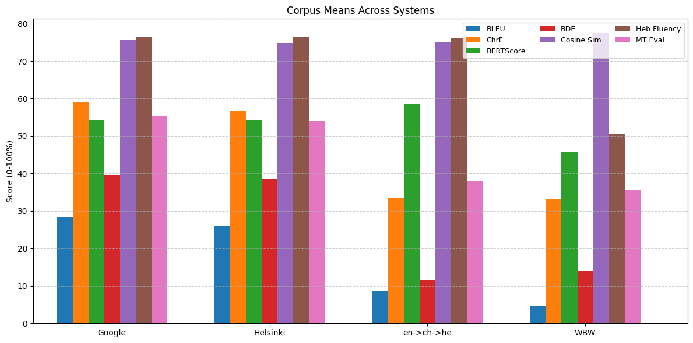
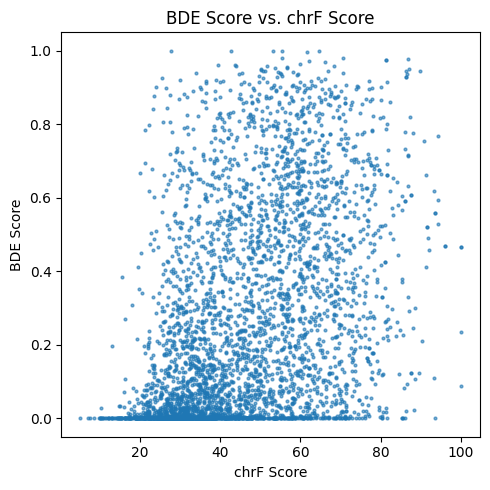
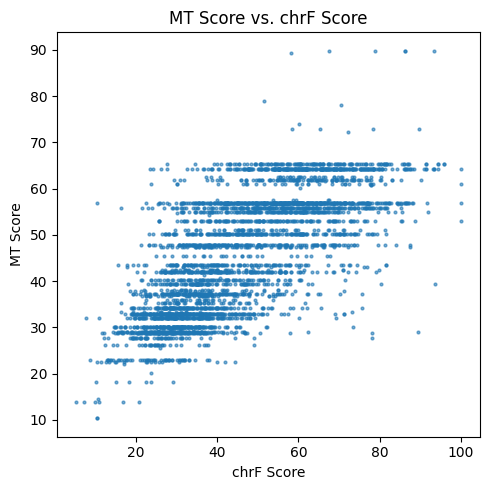

# Reference-Free English–Hebrew Machine Translation Evaluation
**Author:** Gabriel Mazor
## Introduction
Machine translation (MT) evaluation is an essential task for measuring progress in natural language processing. Traditional metrics such as BLEU and chrF have been widely adopted because they are simple, fast, and correlate reasonably well with human judgments. However, these metrics are not without limitations. BLEU, for example, relies on n-gram overlap and does not capture semantic adequacy, while chrF focuses on character-level similarity and can overestimate fluency for poor translations.

In recent years, embedding-based metrics, such as BERTScore have improved semantic evaluation using contextual embeddings. However, that require access to reference translations, making them not always practical in low-resource or deployment settings.

In this project, we explore an alternative approach: combining multiple resource-free features, such as cross-lingaul Bidirectional Entailment (BDE) cosine similarity and language fluency score into a single interpretable metric through linear modeling and isotonic calibration. The goal is not to outperform all existing metrics, but rather to demonstrate that a lightweight, reference-free combination can still provide competitive and reliable evaluation, particularly useful in scenarios where references are unavailable or hard to obtain.

Our experiments focus specifically on English–Hebrew translation, a challenging and relatively low-resource language pair. Hebrew presents unique linguistic difficulties due to its morphology, word order flexibility, and relatively smaller availability of parallel corpora. This makes it an ideal testing ground for exploring reference-free evaluation methods that can remain robust even when traditional resources are limited.

### Related Work
One influential contribution to cross-lingual semantic evaluation was the introduction of the XNLI and HebNLI datasets. This benchmark extended natural language inference (NLI) to multiple languages, enabling models to reason about entailment, contradiction, and neutrality beyond English. It provided the foundation for evaluating how well multilingual representations capture meaning across languages, which is directly relevant to translation evaluation.

Building on these ideas, Chen et al. proposed Bi-directional Entailment (BDE) as a framework for machine translation evaluation. Their approach evaluates whether the meaning of a translation is preserved by checking entailment in both directions: from source to target and from target back to source. This symmetry helps detect subtle adequacy issues that may be overlooked by surface-based similarity metrics. Importantly, their work demonstrated that entailment-based signals can correlate strongly with human judgments, but still requires reference translations.

While Chen et al. focus primarily on entailment, we combine BDE with additional resource-free signals such as cosine similarity and fluency scores. By calibrating these signals into a single interpretable metric, we extend the promise of entailment-based evaluation into a broader alternative suitable for low-resource settings like English–Hebrew.

## Methodology
### Problem Approach
The core idea is to measure cross-lingual fit via NLI and enrich it with semantic similarity, fluency, and simple structural penalties, then combine these signals in a small, interpretable model.
- **Cross-lingual entailment:** English-only NLI failed on HebNLI (essentially guessing), while a multilingual XNLI model produced meaningful English-Hebrew entailment out of the box, without fine-tuning.
- **Complementary features:** Single features were noisy at sentence level, so we add cosine similarity (multilingual sentence embeddings), Hebrew fluency (masked-LM pseudo-likelihood), and lightweight penalties for length and english leftovers.
- **Combination and calibration:** We fit non-negative least squares (NNLS) on standardized features, then calibrate the linear score monotonically to chrF on the train split via isotonic regression, all reported ‘MT-Score’ values are post-calibration and scaled to 0–100.

### Data and Translation Systems
We use FLORES-101 English–Hebrew as the English-Hebrew source–reference corpus. To obtain outputs of varying quality, we generate Hebrew translations with four systems:
- Google Translate (English-Hebrew)
- Helsinki-NLP opus-mt-en-he (English-Hebrew)
- Pivoted Helsinki (English-Chinese-Hebrew)
- Word-by-word Helsinki (weak baseline)

### Features
For each premise–hypothesis pair we compute:
- **Bidirectional Entailment (BDE):** run XNLI twice (English-Hebrew, Hebrew-English), extract entailment probabilities $E_f, E_b$, convert to odds $o=E/(1{-}E)$, and aggregate $o_f \cdot o_b$; min–max normalize per corpus.
- **Cosine similarity:** LaBSE sentence embeddings, take the diagonal of the pairwise cosine matrix for aligned pairs.
- **Hebrew fluency:** masked-LM pseudo-likelihood over the hypothesis (per-token masking and log-prob aggregation)
- **Penalties:** light, reference-free checks

For comparison baselines, we also compute BLEU, chrF, and BERTScore against the FLORES references.

### Implementation
Training the NNLS and isotonic calibration runs in a few milliseconds on our data. The expensive parts are:
- Computing entailment on sentence pairs
- Masked-LM fluency (one forward pass per masked token)
Yet, it took only a couple of minutes to score each system.

### Technical Challenges
- Single-direction entailment over-scores poor translations, bi-directionality stabilizes it.
- Sentence-level variance is high for any single feature, combination is crucial.

## Experimental Results
### Setup
We evaluate on FLORES-101 English-Hebrew (997 sentences). For the combined MT-Score, we split the 997 items into 70/30 train/test, fit the NNLS combiner and isotonic calibration on the train split, and report results on the held-out test split. All feature values are scaled to 0–100 for interpretability.

### Measurement protocol
#### Model Training Results
$R^2$ and Spearman correlation between chrF and MT-score

| R2 | Spearman |
|--------------:|---------:|
| 0.493         | 0.724    |

#### System Level

*Metrics means across systems on FLORES-101 English–Hebrew.*

| System   |  BLEU |  chrF | BERTScore (%) | BDE (%) | Heb Flu (%) | MT-Score (%) |
|----------|------:|------:|--------------:|--------:|------------:|-------------:|
| GT       | 28.47 | 59.13 |         54.41 |   39.58 |       76.33 |        55.40 |
| Helsinki | 25.92 | 56.68 |         54.37 |   38.46 |       76.36 |        54.04 |
| Pivot    |  8.69 | 33.44 |         58.49 |   11.58 |       76.03 |        37.93 |
| WBW      |  4.51 | 33.29 |         45.66 |   13.80 |       50.57 |        35.57 |

- BDE and MT-Score clearly separate strong from weak systems without references: Google/Helsinki score high, Pivot/WBW low.
- BDE gaps are large and intuitive: Google (39.6) vs Pivot (11.6), and Helsinki (38.5) vs WBW (13.8).
- MT-Score mirrors chrF’s ranking while being reference-free: Google (55.4) = Helsinki (54.0) $>$ Pivot (37.9) $>$ WBW (35.6).
- BERTScore behaves differently at system level. This is consistent with semantic overlap being preserved through pivoting while adequacy/wording degrades, it underlines why entailment symmetry and fluency are useful complements.

### Sentence Level
At the sentence level, variance is higher. BLEU, chrF and BERTScore sometimes disagree with BDE, when one scoring a sentence high while another scores it low. However, it is interesting to see that MT-Score correlates stronger with chrF than BDE alone.
|  |  |
|---|---|
| BDE vs chrF | MT-Score vs chrF |

## Discussion
In this project, we wanted to test whether entailment models can be the foundation for a reference-free machine-translation quality metric.
The short answer is yes on the system level, but not as reliable at the sentence level.

### What We Found
- **System means:** Both BDE and our MT-Score consistently ranked systems in the expected order (Google and Helsinki $>$ Pivot and WBW). This shows that a reference-free combination of signals can reflect overall quality without access to references.
- **Sentence level:** Variance is higher. Single features (including plain entailment) can be over-confident on poor translations. The combined score correlates with chrF better than BDE alone, but still leaves room for improvement on hard sentences. The xplained variance against chrF is modest, $R^2 = 0.493$. This shows us that the linear combination captures about half of the variation, which is good enough for ordering but less precise on single sentence predictions.
- Cross-lingual NLI is robust to paraprhrase but too forgiving of omissions, small inconsistencies, or word order in sentence.
- Embedding similarity captures meaning well, but similarly to entailment, not sensitive to word order. It is kept in the model only because when a translation is completely off it penalize it significantly.
- Masked language fluency helps the model with word order, where entailment and similarity fail.
- Bidirectional Entailment helped lower over saturated results.
- Penalties for length, and leftover of latin characters are a fast way to find suspectadly bad translations.
- Isotonic Regression turned the raw linear score into a better aligned quality score. Without it the scores had smaller interval.

### Limitations
- We trained our regression model on chrF alone due to the highest resulted correlation. Further exploration may lead to use average of BERTScore, BLEU and chrF or other methods, to get higher correlation, $R^2$ score, and potentially even better performance on single sentence scoring.
– The used cross-lingual entailment model was not specifically trained on Hebrew.

### Future Impovements
- **Test on Another Language:** To see if it scores better for languages that are part of the NLI dataset.
- **Stronger Entailment Classification:** Fine-tune XNLI on HebNLI to make entailment stricter.
- **Improve Model Features:** Test other/existing features to improve $R^2$ scores, correlation and sentence-level significance.

A reference-free metric built from bidirectional entailment, semantic similarity, fluency and simple penalties, can already track system-level quality. It’s not a replacement for strong reference-based metrics yet, but it’s a practical option when references are unavailable—and a solid base to improve with modest fine-tuning and better negatives.

